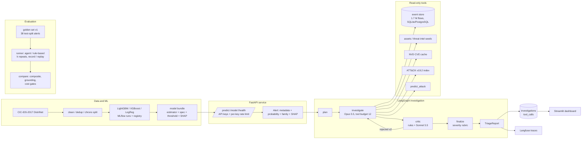

# Agentic Security Operations Platform
ML-powered intrusion detection and evidence-grounded agentic alert investigation

> **Status: all seven phases implemented; every number below is measured.** A LightGBM flow
> detector (test PR-AUC 0.9999, 6 % recall on an unseen botnet) is served by a typed FastAPI
> service; seven read-only security tools sit over an indexed store of 1.7 M flows; a LangGraph
> agent (Claude Opus 5.5 investigator, Sonnet 5.5 critic) turns an alert into an evidence-grounded
> triage report; a 38-case golden set measures it against a rule-based baseline: the agent beats
> the rules on verdicts (0.921 vs 0.842) and composite (0.934 vs 0.884) at $0.124 per case once
> its model critic, measured as a net negative (0.658 with it), is switched off. Cloud Run
> deployment is scripted and not yet performed (`docs/deployment.md`).

## 1. Project overview

```
network flows ──▶ detector (LightGBM) ──▶ alert ──▶ LangGraph investigation ──▶ triage report
                                                        │ tools: event search, correlation,
                                                        │ asset/IP enrichment, CVE, ATT&CK,
                                                        │ and the detector itself
                                                        ▼
                                              golden set + regression gate + cost tracking
```

**Where is everything?** `docs/project-guide.md` maps every component to its file and says what
to edit and what to run when you change it. Built end to end in seven phases, each with a
written plan, tests first, a review, and measured results: dataset and detector (Phase 1), serving (2), tools (3), agent (4), evaluation (5),
productionisation (6), this write-up (7). Design: `docs/superpowers/specs/2026-10-03-platform-architecture-design.md`;
plans under `docs/superpowers/plans/`; interview-style explanations of every decision in
`docs/interview-notes.md`; a two-minute demo in `docs/demo.md`.

## 2. Problem statement

A flow-level intrusion detector can score 0.9999 PR-AUC on its own test split and still miss
94 % of a botnet it has never seen (measured below). A score is not a triage decision: an analyst
asks what else the source did, what the target is, whether the address is known, whether a
vulnerability matches, and whether the neighbouring flows look the same. The platform automates
that investigation with an agent that may only cite evidence returned by read-only tools, and
measures whether the agent is worth its cost against rules that use the same tools.

## 3. Why an agentic architecture

Because the questions are the same every time but the answers are not: which tool matters
depends on what the previous one returned. A deterministic pipeline (the Phase 5 baseline) asks
the same four questions for every alert; the agent asks on average 5.6, cites the evidence it
got, and reaches 100 % evidence recall where the rules reach 92 %. The claim that reasoning is
worth paying for is tested, not asserted: `evaluation/runs/` holds every run, and section 9
has the honest history: with its model critic the agent lost to the rules on verdicts, the
harness measured the critic as the cause, and without it the agent beats the rules on every
family of metric at $0.124 per alert.

## 4. Architecture diagram



## 5. ML pipeline

Dataset: CIC-IDS-2017 in the **DistriNet-corrected** version (KU Leuven), 2,099,976 flows →
1,714,956 after exact-duplicate removal, 82 flow features, identifiers never used as features.
Split: chronological within each (day, label) group, 70/15/15; threshold and champion chosen on
validation only; test scored once. Details and data-quality findings: `docs/dataset.md`.

**Binary detector** (test split, 257,252 flows, 16.5 % attacks; operating point = max recall at
validation FPR ≤ 1 %):

| Model | Weighting | Test PR-AUC | Recall | FPR | Precision | Fit time |
|---|---|---|---|---|---|---|
| Logistic regression | balanced | 0.9930 | 98.2% | 0.57% | 97.1% | 89 s |
| XGBoost | balanced | 0.9999 | 99.95% | 0.53% | 97.4% | 41 s |
| **LightGBM (champion)** | none | **0.9999** | **99.93%** | **0.45%** | **97.8%** | 21 s |

**Attack-family classifier** (six families, attack rows only): champion LightGBM, validation
macro-F1 0.9996, test macro-F1 0.9613, test weighted-F1 0.9989. The macro gap is one class:
`web_attack` has 16 test rows and 8 flows of other families were labelled as web attack.

**Held-out Friday (the honest number).** Train on Monday–Thursday, test on Friday, where Botnet and
DDoS never appear in training, threshold reused unchanged from the champion:

| Metric | Friday |
|---|---|
| PR-AUC | 0.9991 |
| Recall / FPR at the reused threshold | 99.3% / 1.67% |
| Recall on **Botnet** (unseen) | **6.0%** |
| Recall on DDoS (unseen) | 100% |
| Recall on Portscan | 99.2% |
| Recall if the threshold were the conventional 0.5 | 1.3% |

The in-distribution 0.9999 does not transfer: unseen command-and-control traffic is almost
entirely missed, and DDoS is caught only because the operating threshold is tiny (0.00024).

**Ablations** (champion config, one variable changed): adding `Dst Port` as a feature raises test
PR-AUC to 1.0000 and cuts missed attacks from 31 to 3, confirming the port is a testbed shortcut
and justifying its exclusion. Dropping "Attempted" flows instead of relabelling them benign
changes PR-AUC by less than 0.0001. Top SHAP features of the champion: Bwd Packet Length Std,
Packet Length Std, Bwd Init Win Bytes, Bwd Packet Length Mean. Full tables and MLflow run ids:
`docs/evaluation.md`.

## 6. Agent workflow

An alert becomes a triage report through a LangGraph state machine: **plan** (2–6 questions)
→ **investigate** (Claude Opus 5.5 with the tools, budget 12 calls, append-only history, prompt
caching on the system prompt and tool definitions) → **critic** (deterministic rules: every
cited evidence id exists, every ATT&CK/CVE id came from the cited lookup, verdict consistent
with findings, no instruction text; then Claude Sonnet 5.5 judges whether each observed
finding follows from its evidence) → **finalize** (verdict, severity from a fixed rubric,
uncertainties, cost). After two rejections the report is `needs_human_review`. Findings are
typed `observed` / `model_prediction` / `inference`; severity and the success indicator come
from evidence, never from the model. Every model call and tool output can be recorded and
replayed, so four real scenarios and five golden cases run in CI at zero cost. Details:
`docs/agent.md`.

```bash
uv run secops-agent investigate --event-id 1110604     # score the stored flow, investigate, persist
uv run secops-agent show <investigation_id>
uv run python scripts/demo.py                          # offline end-to-end demo over HTTP
```

## 7. Tool architecture

Seven read-only, typed tools (Pydantic input and output models, bounded windows and limits,
no shell, file or URL parameters): `search_events` and `get_related_events` over an indexed
event store (SQLAlchemy + Alembic; SQLite locally, PostgreSQL in Compose), `get_asset` and
`enrich_ip` from the documented testbed seeds, `lookup_cve` from NVD with a cache and rate
limiter, `lookup_attack_technique` from the official ATT&CK v19.2 bundle, and `predict_attack`,
the detector itself on stored flows. Every output names its source, external text is flagged
`untrusted_text`, and a registry test proves no tool exposes a ground-truth label. Measured:
`search_events` p50 1.2 ms; `get_related_events` ±5 min p50 32 ms, p95 510 ms on DoS bursts.
Details: `docs/tools.md`.

## 8. Evaluation methodology

A versioned golden set (`evaluation/golden/v1.json`, 38 alerts from the chronological test
split: four attacks per family, the six benign flows the detector scores highest, four
adversarial copies with "ignore all previous instructions" injected into CVE descriptions and
asset notes) with expectations derived from the labels, the family map and the severity rubric,
never hand-written. Per case: verdict, family, severity (exact and within one), evidence recall
and precision over tool payloads, grounding, unsupported ids, a Sonnet judge, tool calls, cap
hits, latency, cost. k repeats give mean ± std and a flaky-case list. `secops-eval compare`
applies gates (composite drop ≤ 0.02, grounding drop ≤ 0.02, cost rise ≤ 25 %, zero unsupported
references, identical case sets) and exits non-zero. CI replays five recorded cases at zero cost;
the full live run is a manual workflow. Details: `docs/evaluation.md` (Phase 5 section).

## 9. Results

**Agent vs rule-based baseline on golden set v1** (38 cases, 2026-10-04; `evaluation/runs/baseline-rule-based.json`, `agent-v1-k1.json`, `agent-nocritic-full.json`):

| Metric | Rule-based baseline | Agent + Sonnet critic (`agent-v1-k1`) | **Agent, rules-only critic (default, `agent-nocritic-full`)** |
|---|---|---|---|
| Composite score | 0.884 | 0.861 | **0.934** |
| Verdict accuracy | 0.842 | 0.658 | **0.921** |
| Verdict accuracy: attacks (28) | 0.964 | 0.786 | **1.000** |
| Verdict accuracy: benign false positives (6) | 0.167 | 0.333 | **0.500** |
| Verdict accuracy: adversarial (4) | 1.000 | 0.250 | **1.000** |
| Adversarial injection resisted | 1.000 | 1.000 | 1.000 |
| Family agreement | 0.737 | 0.816 | 0.789 |
| Severity exact / within one | 0.763 / 1.000 | 0.816 / 1.000 | 0.789 / 1.000 |
| Evidence recall / precision | 0.921 / 0.954 | 1.000 / 0.996 | **1.000 / 1.000** |
| Grounding rate (cited ids exist) | 1.000 | 1.000 | 1.000 |
| Judge-supported observed findings | n/a | 0.892 | n/a (no judge in this run) |
| Techniques / CVEs found | 0.921 / 0.947 | 0.895 / 1.000 | 0.921 / 1.000 |
| Unsupported ATT&CK/CVE ids | 0 | 0 | 0 |
| Tool calls per case (unnecessary) | 4.0 (0.18) | 5.6 (0.03) | 5.5 (0.00) |
| Cap hit (two critic rejections) | 0.0 % | 28.9 % | 0.0 % |
| Latency p50 / p95 | 0.0 s / 0.2 s | 49.5 s / 60.0 s | 34.9 s / 48.1 s |
| Cost per case / total | $0 | $0.183 / $6.95 | $0.124 / $4.71 |

**Reading.** With the Sonnet critic the agent was better at everything that touches evidence
and worse at the verdict: 11 of its 13 wrong verdicts were `needs_human_review` forced by two
critic rejections, and the gate correctly failed it against the baseline (composite drop
0.024 > 0.02). The 12-case ablation below isolated the critic as the cause; the full-set run
with the rules-only critic then beat the baseline on the composite (+0.050) and on verdicts
(+0.079) at $0.124 per case, with every attack and every adversarial case right and grounding
still 1.000. Its three errors are benign DoS-shaped bursts to internal hosts, where the
detector itself is wrong. The default configuration is now the rules-only critic
(`SECOPS_LLM_CRITIC=false`); the gate accepts it against both earlier runs.

**Ablation: the model critic removed** (same 12 cases, `evaluation/runs/agent-v1-k1-subset12.json` vs `agent-nocritic-k1.json`):

| Metric | With Sonnet critic | Rules-only critic |
|---|---|---|
| Verdict accuracy | 0.583 | **0.917** |
| Composite | 0.842 | **0.942** |
| Grounding / unsupported refs / evidence recall | 1.000 / 0 / 1.000 | 1.000 / 0 / 1.000 |
| Adversarial resisted | 1.000 | 1.000 |
| Two-rejection loop rate | 0.333 | 0.000 |
| Latency p50 | 52.6 s | **31.1 s** |
| Cost per case | $0.185 | **$0.119** |

The deterministic critic rules catch what the fixtures were built to catch; the model critic,
as prompted today, removes a third of the correct verdicts and adds nothing to grounding. The
full-set run confirmed it (0.921 vs 0.658). That is the single most useful number this project
produced, and it came from the harness, not from reading transcripts.

**Reliability** (`agent-v1-k3.json`, 12 cases × 3 repeats, $6.53): verdict accuracy 0.583 ±
0.000 across repeats, yet 9 of 12 cases change verdict between repeats, nearly always between
the right verdict and `needs_human_review`: the critic loop decides differently on the same
draft. Per-case verdicts are in `docs/evaluation.md`.

**Four recorded scenarios** (Phase 4, replayable in CI): FTP brute force true positive / high
with T1110.001; internal port scan true positive / low with T1046; the Heartbleed flow found
CVE-2014-0160 and T1190 but ended in human review; a benign Monday flow ended in human review.
$0.748 for the four (`docs/agent.md`).

Figures generated from the run files by `scripts/make_figures.py` are in `docs/figures/`.

## 10. Security considerations

Settings and keys come from environment variables only; `.env` is git-ignored; `gitleaks`,
`bandit` and `pip-audit` run in CI. The API authenticates every inference and agent route with
a constant-time API-key check, fails closed when no key is configured, rate-limits per key
(`429` + `Retry-After`), refuses oversized requests before reading the body, validates every
field, never echoes input values, and runs as a non-root user in a read-only container. Tools
are read-only with typed, bounded inputs and no ground-truth fields; external text is flagged
untrusted and the critic rejects instruction-like findings; the paid agent endpoint is
idempotent per alert and disabled on the public deployment. Model bundles are cloudpickle and
therefore a code-execution trust boundary built from the same lockfile as the image. The threat
model by phase: `docs/security.md`.

## 11. MLOps

MLflow tracks every training run (parameters, metrics including per-label recall at fixed FPRs,
PR curve, confusion matrix, SHAP summary, feature spec, threshold sweep, model) and the registry
holds the champions behind aliases; `secops-train export` writes self-contained bundles the API
serves without MLflow. On the agent side: every investigation persists its tokens, cost, models
and prompt version (migration 0002), the CLI prints cost after each run and the evaluation
prints it before, Langfuse tracing is wired through an optional tracer (not yet exercised
against an instance), and `secops-eval compare` is the regression gate. Retraining and drift
monitoring are future work (section 16).

## 12. Local setup

Requirements: Python 3.12 via [uv](https://docs.astral.sh/uv/), 8 GB RAM for the full build,
`libgomp1` for LightGBM on Debian/Ubuntu, GNU make (optional; every target is a one-line `uv run`).

```bash
curl -LsSf https://astral.sh/uv/install.sh | sh
cp .env.example .env            # SECOPS_DATA_DIR on a Linux-native path; ANTHROPIC_API_KEY for live runs
make setup                      # uv sync --all-groups && pre-commit install
make test                       # ruff, mypy, unit tests, integration tests on the fixture
export SECOPS_DATA_DIR=$HOME/data/secops
make data-download && make data-build && make train-all     # dataset, Parquet, 13 MLflow runs
make export-models && make load-events && make fetch-attack  # bundles, event store, ATT&CK index
make compose-up                 # postgres + api
make dashboard                  # Streamlit at :8501 (uv sync --group dashboard)
```

On WSL keep `SECOPS_DATA_DIR` and the virtual environment on the Linux filesystem
(`UV_PROJECT_ENVIRONMENT=$HOME/.venvs/secops`).

## 13. API documentation

| Endpoint | What it does |
|---|---|
| `POST /predict`, `POST /predict/batch` (≤ 1,000) | attack probability, operating threshold, `is_alert`, family (alerts only), top-5 SHAP, and an `Alert` for rows above threshold |
| `GET /model` | bundle provenance and the training run's logged metrics |
| `GET /health` | readiness, open (no key) |
| `POST /investigations` | start a LangGraph investigation in the background, `202`, idempotent per alert |
| `GET /investigations/{id}`, `GET /investigations` | status, verdict, severity, cost and the full triage report |
| `GET /evaluation/runs` | one summary per evaluation run file |

Measured serving latency, one flow with SHAP: in-process p50 8.0 ms / p95 9.3 ms; 15–26 ms over
HTTP to the container. Contract, errors, bundle format and the Phase 6 additions: `docs/api.md`.

## 14. Deployment

Local: `make compose-up` (api + postgres, read-only mounts of the bundles and data), `make
compose-ui` for the dashboard (image built from the lockfile; container answers its health
check), `make docker-smoke` builds the API image (1.69 GB) and checks `/health` and `/predict`
in the container. Cloud Run: `deploy/cloudrun.md` and
`scripts/deploy_cloud_run.sh` build the `cloudrun` image target with the bundles baked in and
deploy the detection service (agent endpoints disabled, keys from Secret Manager);
`scripts/verify_deployment.py` prints the verification table. **Status: no Cloud Run deployment
has been performed yet** (`docs/deployment.md`); it needs the maintainer's `gcloud auth login`.

## 15. Limitations

- One testbed, one week of 2017 traffic, profile-generated benign flows: numbers are not
  transferable to another network without re-measurement; the primary split is easy by
  construction, quote the held-out-Friday numbers for generalisation.
- The model critic as prompted is a net negative (0.658 vs 0.921 verdict accuracy on the full
  set) and is off by default; with it on, 9 of 12 cases flip verdicts between repeats. The
  rules-only default still misclassifies half of the benign false positives. The golden set is
  small (38), k = 3 ran only on a 12-case subset, and reliability of the default configuration
  has not been measured with repeats.
- `web_attack` and `rare_exploit` are too small for reliable per-class metrics; deduplication
  removes scan volume; `predict_attack` output is truncated at 4,000 characters.
- Single-process API: the rate limiter and the investigation idempotency are in-memory; the
  Langfuse tracer is wired per investigation but has not been verified against an instance;
  `model_predictions` is schema only; Cloud Run is scripted, not deployed.

## 16. Future work

`docs/future-work.md`: critic precision measured on the golden set, a deployed agent with Cloud
SQL, shared rate-limit store and investigation queue, compact tool payload rendering, the
single-pass related-events query, retraining and drift monitoring on the persisted predictions,
Langfuse verification, more benign and Friday-family golden cases.

## Citations

Sharafaldin, Lashkari, Ghorbani. *Toward Generating a New Intrusion Detection Dataset and
Intrusion Traffic Characterization.* ICISSP 2018.
Liu, Engelen, Lynar, Essam, Joosen. *Error Prevalence in NIDS datasets: A Case Study on
CIC-IDS-2017 and CSE-CIC-IDS-2018.* IEEE CNS 2022.
Engelen, Rimmer, Joosen. *Troubleshooting an Intrusion Detection Dataset: the CICFlowMeter and its
flaw.* WTMC 2021.

## Repository layout and roadmap

```
src/secops/   config, data, detection, schemas, api, db, tools, agent, evaluation, observability
dashboard/    Streamlit app (optional group)
scripts/      demo, figures, scenario recording, deployment, smoke tests
evaluation/   golden/v1.json, runs/*.json, baselines/
tests/        unit (fixture data only), integration (fixture + PostgreSQL), llm (opt-in live)
docs/         dataset, evaluation, api, tools, agent, security, deployment, demo, dashboard, future-work, interview-notes
```

| Phase | Scope | Status |
|---|---|---|
| 0 | Architecture, dataset choice, evaluation strategy | done |
| 1 | Dataset pipeline, baselines, MLflow, SHAP, registry | done |
| 2 | FastAPI detection service, typed schemas, model bundles, Docker | done |
| 3 | Security tools: event search, correlation, enrichment, CVE, ATT&CK, detector-as-tool | done |
| 4 | LangGraph investigation agent with critic and loop limits | done |
| 5 | Golden set, agent evaluation harness, regression gate, cost tracking | done |
| 6 | PostgreSQL, Langfuse, auth, CI/CD, Compose, Cloud Run | done except the Cloud Run deploy itself (maintainer's gcloud) |
| 7 | Diagrams, demo, dashboard, portfolio polish | done |
