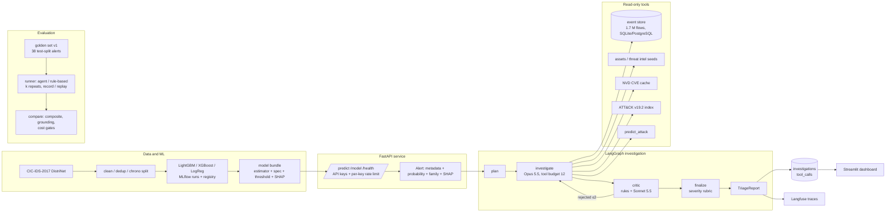

# Architecture

The diagram is the one in the README (kept here as the source of truth; GitHub renders Mermaid
inline, so no exported image is needed). Each box is a module or service that exists in the
repository; the arrows are the real call paths.

## Reading the diagram

- **Data and ML** (`src/secops/data`, `src/secops/detection`): the corrected CIC-IDS-2017 flows
  are cleaned, deduplicated and split chronologically; LightGBM, XGBoost and logistic regression
  are trained under MLflow; the champion is exported as a self-contained bundle.
- **FastAPI service** (`src/secops/api`): serves predictions from the bundle, authenticates with
  API keys, rate-limits per key, and turns above-threshold predictions into `Alert` objects.
- **LangGraph investigation** (`src/secops/agent`): plan → investigate → critic → finalize with a
  tool budget, at most two critic rejections, a deterministic severity rubric and record/replay
  of every model call.
- **Read-only tools** (`src/secops/tools`): typed, bounded, label-free; the detector is one of
  them.
- **Persistence and observability** (`src/secops/db`, `src/secops/observability`): investigations
  and tool calls in PostgreSQL or SQLite through Alembic migrations; one trace per investigation
  when Langfuse keys are configured.
- **Evaluation** (`src/secops/evaluation`): the golden set, the rule-based baseline, the runner
  with repeats and replay, and the regression gate.
- **Dashboard** (`dashboard/`): Streamlit over the API, three pages.
