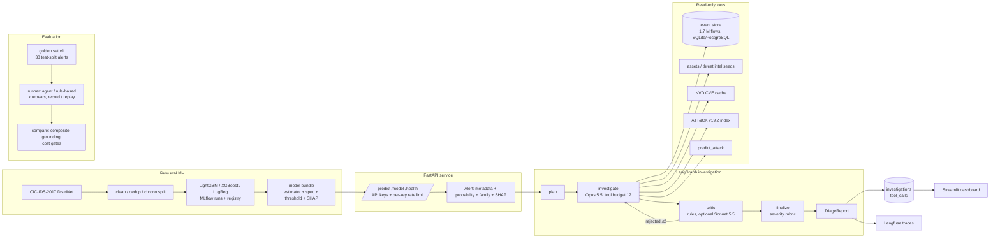

# Project guide: what this is, how it fits together, and where to change what

This is the map of the repository. The README is the pitch; this file is for the person who
has to change something next month.

## What the project does, in one paragraph

Network flows from the CIC-IDS-2017 dataset (corrected version) are scored by a LightGBM
detector served over FastAPI. Every flow above the operating threshold becomes an `Alert`. A
LangGraph agent investigates the alert with seven read-only tools (event store, asset and IP
enrichment, NVD, ATT&CK, the detector itself), writes a `TriageReport` whose findings must cite
evidence the tools returned, and a critic rejects what the evidence does not support. A golden
set of 38 test-split alerts measures the agent against a rule-based investigator; a regression
gate exits non-zero when a change makes it worse. Everything that costs money is recorded and
replayed in CI for free. A Streamlit dashboard shows alerts, investigations and results.

## Architecture



## Where everything is: "to change X, edit Y"

### Data and detector (Phase 1)

| To change | Edit | Then run |
|---|---|---|
| Which columns are features, the label → family map | `src/secops/data/schema.py` (`FEATURE_COLS`, `FAMILY_MAP`) | `make data-build && make train-all` |
| Cleaning (dedup, "Attempted" policy, Infinity handling) | `src/secops/data/clean.py` | `make data-build` |
| Split strategy (chronological within group, held-out Friday) | `src/secops/data/split.py` | `make data-build` |
| Model candidates, hyper-parameters, class weighting | `configs/*.yaml`, `src/secops/detection/models.py` | `make train-all` |
| Threshold rule (recall at FPR budget), champion rule | `src/secops/detection/metrics.py`, `secops-train promote-best` in `src/secops/detection/cli.py` | `uv run secops-train promote-best` |
| What a model bundle contains | `src/secops/detection/bundle.py` | `make export-models` |
| Measured detector numbers in the docs | `docs/evaluation.md` sections 1–5 (written from MLflow runs, never by hand) | `uv run secops-train report ...` |

### Serving (Phase 2 and 6)

| To change | Edit |
|---|---|
| Request / response contracts | `src/secops/schemas/flow.py`, `prediction.py`, `alert.py`, `api.py` |
| Endpoints `/predict`, `/model`, `/health` | `src/secops/api/routes.py` |
| Agent endpoints `/investigations`, `/evaluation/runs` | `src/secops/api/investigations.py` |
| API keys, rate limit, agent mode, model dir, DB URL | `src/secops/api/settings.py` (`SECOPS_*` environment variables, see `.env.example`) |
| Rate limiter behaviour | `src/secops/api/ratelimit.py` |
| App wiring, lifespan, error handlers | `src/secops/api/app.py` |
| Container image, Compose services, dashboard image | `Dockerfile`, `docker-compose.yml` |
| Cloud Run procedure and script | `deploy/cloudrun.md`, `scripts/deploy_cloud_run.sh`, `scripts/verify_deployment.py` |

### Tools and the event store (Phase 3)

| To change | Edit |
|---|---|
| A tool's inputs, bounds or outputs | `src/secops/schemas/tools.py` (models) and the tool module in `src/secops/tools/` (`events.py`, `enrichment.py`, `attack.py`, `cve.py`, `detector.py`) |
| Which tools exist | `src/secops/tools/registry.py` (`EXPECTED_TOOLS`, `build_registry`) |
| Asset inventory and known attackers | `data/seeds/assets.yaml`, `data/seeds/threat_intel.yaml` |
| Event store schema | `src/secops/db/models.py` + a new Alembic migration in `src/secops/db/migrations/versions/` |
| ATT&CK index / NVD client | `scripts/fetch_attack.py`, `src/secops/tools/nvd.py` |
| Tool docs and measurements | `docs/tools.md` |

### Agent (Phase 4)

| To change | Edit | Note |
|---|---|---|
| Prompts (planner, investigator, critic) | `src/secops/agent/prompts/*.md`; bump `PROMPT_VERSION` in `prompts/__init__.py` | Any prompt change invalidates recorded fixtures: re-record with `scripts/record_agent_scenarios.py --go` (costs money) |
| Graph, loop limits, routing, finalize | `src/secops/agent/graph.py` (`MAX_CRITIC_REJECTIONS`, `AgentDeps`) | |
| Deterministic critic rules, LLM critic | `src/secops/agent/critic.py` | |
| Severity rubric, family normalisation, success heuristic | `src/secops/agent/rubric.py` | Also used by the golden set |
| Report schema (findings, references, uncertainties) | `src/secops/schemas/agent.py` | `CriticIssue` must not change (it is in every recorded critic request) |
| Models, effort, tool budget, critic on/off, API key | `src/secops/agent/settings.py` (`SECOPS_INVESTIGATOR_MODEL`, `SECOPS_CRITIC_MODEL`, `SECOPS_AGENT_EFFORT`, `SECOPS_TOOL_BUDGET`, `SECOPS_LLM_CRITIC`, `ANTHROPIC_API_KEY`) | |
| Model prices | `PRICES_USD_PER_MTOK` in `src/secops/schemas/agent.py` | Dated table; update the date with the numbers |
| Tool execution, evidence envelope, budget | `src/secops/agent/tools.py` | |
| Record / replay of model calls and tool outputs | `src/secops/agent/llm.py`, `replay.py`, `fixtures.py` | |
| Persistence of investigations | `src/secops/agent/repository.py`, migration `0002` | |
| CLI `secops-agent` | `src/secops/agent/cli.py` | |
| Tracing (Langfuse) | `src/secops/observability/__init__.py` | `LANGFUSE_*` variables |
| The four recorded scenarios | `tests/fixtures/llm/<scenario>/` | `scripts/refresh_agent_scenarios.py` re-derives reports at zero cost after finalize-only changes |
| Agent docs and measured table | `docs/agent.md` (`scripts/agent_scenario_table.py` prints the table) | |

### Evaluation (Phase 5)

| To change | Edit | Then run |
|---|---|---|
| Golden set size, sampling, expectations per family | `src/secops/evaluation/golden.py` (`EXPECTED_BY_FAMILY`, `build_golden_set`) | `uv run secops-eval build-golden` (bumps nothing automatically: set `version` when expectations change) |
| Scoring rules and the composite weights | `src/secops/evaluation/metrics.py` (`COMPOSITE_WEIGHTS`) | `uv run secops-eval rescore evaluation/runs/<run>.json` for every run (zero cost) |
| The rule-based baseline | `src/secops/evaluation/baseline.py` | `uv run secops-eval run --run-id baseline-... --investigator baseline` ($0) |
| Gates and thresholds | `src/secops/evaluation/compare.py` (`Gates`) | `uv run secops-eval compare <baseline> <candidate>` |
| Runner (repeats, resume, record/replay, adversarial) | `src/secops/evaluation/runner.py`, `adversarial.py` | |
| Which run is "accepted" | `evaluation/baselines/latest.json` (copy of a run file) | CI compares candidates against it |
| CI smoke cases | `tests/fixtures/eval/smoke/<case>/r0/` + `expected.json` | copied from `$SECOPS_DATA_DIR/eval/recordings/<run>/` |
| Figures | `scripts/make_figures.py` → `docs/figures/*.png` | `uv run python scripts/make_figures.py` |
| Measured tables in the docs | `docs/evaluation.md` Phase 5 (paste from `secops-eval report` / `compare`), README section 9 (checked by `tests/unit/test_readme.py`) | |

### Dashboard (Phase 7)

| To change | Edit |
|---|---|
| Pages and what they show | `dashboard/app.py` (`page_results`, `page_alerts`, `page_detail`, `page_evaluation`) |
| How it talks to the API | `dashboard/client.py` (`SECOPS_API_URL`, `SECOPS_API_KEY`) |
| Tests | `tests/unit/dashboard/test_app.py` (Streamlit `AppTest`, fake client) |

## Data and generated files (not in git)

| What | Where |
|---|---|
| Raw and processed dataset, Parquet, reports | `$SECOPS_DATA_DIR/raw`, `processed`, `reports` |
| MLflow runs and registry | `$SECOPS_DATA_DIR/mlflow` |
| Exported bundles the API serves | `$SECOPS_DATA_DIR/models/{detector,family}` |
| Event store (1.06 GB), ATT&CK index, NVD cache | `$SECOPS_DATA_DIR/events.db`, `attack/index.json`, `cache/nvd` |
| Evaluation recordings (model responses and tool outputs per case) | `$SECOPS_DATA_DIR/eval/recordings/<run_id>/<case>/r<n>/` |

In git: `evaluation/golden/v1.json` (the golden set), `evaluation/runs/*.json` (scored runs,
reports included), `evaluation/baselines/` (accepted runs), `tests/fixtures/llm/` (four
scenarios), `tests/fixtures/eval/smoke/` (five CI cases), `docs/figures/`.

## Commands you will actually use

```bash
make test                                   # ruff, mypy, unit tests, integration on the fixture
uv run secops-api                           # detection + agent API on :8000
uv run secops-agent investigate --event-id 1110604      # one live investigation (~$0.12)
uv run secops-agent show <id> | recent
uv run secops-eval run --run-id <name> --investigator agent|baseline --mode record|replay|live
uv run secops-eval compare evaluation/baselines/latest.json evaluation/runs/<name>.json
uv run secops-eval rescore evaluation/runs/<name>.json  # after a scorer change, $0
uv run python scripts/demo.py               # offline end-to-end demo
make dashboard                              # Streamlit on :8501 (PowerShell: .\scripts\dashboard.ps1)
make compose-up / compose-ui                # postgres + api (+ dashboard)
```

## Documents, by question

| Question | File |
|---|---|
| Why each decision was made, interview-style | `docs/interview-notes.md` |
| Dataset, cleaning, splits | `docs/dataset.md` |
| Detector numbers and run ids; Phase 5 evaluation tables | `docs/evaluation.md` |
| API contract and errors | `docs/api.md` |
| Tools and their boundaries | `docs/tools.md` |
| Agent design and the recorded scenarios | `docs/agent.md` |
| Threat model by phase | `docs/security.md` |
| Compose, Docker, Cloud Run status | `docs/deployment.md`, `deploy/cloudrun.md` |
| Dashboard | `docs/dashboard.md` |
| Demo walkthrough | `docs/demo.md` |
| What is not done and why | `docs/future-work.md`, README section 15 |
| Original design and the per-phase plans with their rulings | `docs/superpowers/specs/`, `docs/superpowers/plans/`, `.superpowers/sdd/*/progress.md` |

## Rules the repository enforces on itself

- No number in the README or docs without a source file: `tests/unit/test_readme.py` checks the
  results table against `evaluation/runs/*.json`; unmeasured things say `TBD`.
- No secrets in git: `.env` is ignored, `gitleaks` runs in CI, fixtures hold request bodies only.
- No ground truth reaches the agent: a registry test walks every tool output schema.
- A prompt or schema change breaks replay loudly (`UnrecordedRequestError`) rather than
  silently changing behaviour.
- Paid runs print their estimated cost before and their measured cost after.
